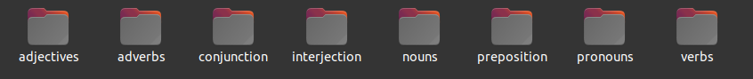

# About organize-folders script :file_folder:

## Whats it solves ?

That script was used in a project were was needed to organize the 'parts of speech' in organized folders and subfolders. Something like this:

```
A
  nouns
       [noun files go here]
  pronouns
       [pronoun files go here]
  adjectives
       [adjective files go here]
  adverbs
       [adverb files go here]
  preposition
        [preposition files go here]
  conjunction
        [conjunction files go here]
interjection
        [interjection files go here]

```

Result:


